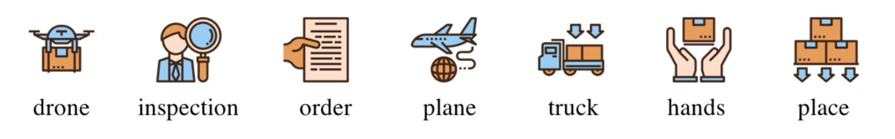

# CS 3630: Intro to Robotics and Perception
## Description
Project for CS 3630: Intro to Robotics and Perception with Youngjoon Lim in Spring 2019 at the Georgia Institute of Technology.

## Requirements
### Devices
1. Computer (macOS or Windows)
2. Smartphone (iOS)
3. [Cozmo Robot with Interactive Cubes](https://anki.com/en-us/cozmo/shop-now.html)

### Installations
1. Install [Python 3](https://www.python.org/downloads/) and required packages
   - Install [SciPy](https://scipy.org/install.html)
   - Install [Scikit-learn](https://scikit-learn.org/stable/install.html)
   - Install [Scikit-image](http://scikit-image.org/docs/dev/install.html)
   - Install [Cozmo SDK](http://cozmosdk.anki.com/docs/)
2. (Recommended) Install [PyCharm](https://www.jetbrains.com/pycharm/download)
3. Install [Cozmo](https://apps.apple.com/us/app/cozmo/id1154282030) on iOS device

## Image Classification
Train an image classifier to classify 7 different symbols (drone, inspection, order, plane, truck, hands, place) below and "none" if it does not recognize any symbols within the image.

The 824 pre-labeled images in the [train](ImageClassification/train/) folder were used to train the classifier and were tested using the 175 images in the [test](ImageClassification/test/) folder.

### Running the Program
1. Download the folder [ImageClassification](ImageClassification/)
2. Run the file [image_classification.py](ImageClassification/image_classification.py)

## Finite State Machine
Make the Cozmo Robot perform certain tasks depending on the symbol it sees. The states and actions are summarized in the table below.

| State | Action |
| --- | --- |
| *Idle* | Monitor the image stream from the camera and classify each image using the trained model. If a symbol is recognized, have Cozmo say the name of the recognized symbol, then switch to the appropriate state. |
| *Drone* | Have Cozmo locate a cube within its view, pick up the cube, drive forward with the cube for 10cm, put down the cube, and drive backwards for 10cm. Then return to *Idle* state. |
| *Order* | Have Cozmo drive in a circle with a radius of 10cm, then return to *Idle* state. |
| *Inspection* | Have Cozmo drive in a square with 20cm sides, while continuously rasing and lowering the lift slowly. Lower the lift at the end of the behavior, then return to *Idle* state. |

### Adding Training Images
1. Download the folder [FiniteStateMachine](FiniteStateMachine/)
2. Connect computer to iOS device
3. Wirelessly connect iOS device to Cozmo and enable SDK Mode
4. Execute the commands in the command line with the format:  
   `python collectImages.py numImgPerLabel label1 label2 ...`
   - To collect 8 images, one of each image type:  
   `python collectImages.py 1 drone inspection order plane truck hands place none`

### Running the Program
1. Download the folder [FiniteStateMachine](FiniteStateMachine/)
2. Connect computer to iOS device
3. Wirelessly connect iOS device to Cozmo and enable SDK Mode
4. Run by executing the command: `python finite_state_machine.py`
   - If there is no "model.sav" file in the folder, the program will train a model before starting up the finite state machine
   - If there already exists a "model.sav" file in the folder, the program will load the existing model
   - To force the program to train a new model, use the command: `python finite_state_machine.py train`
